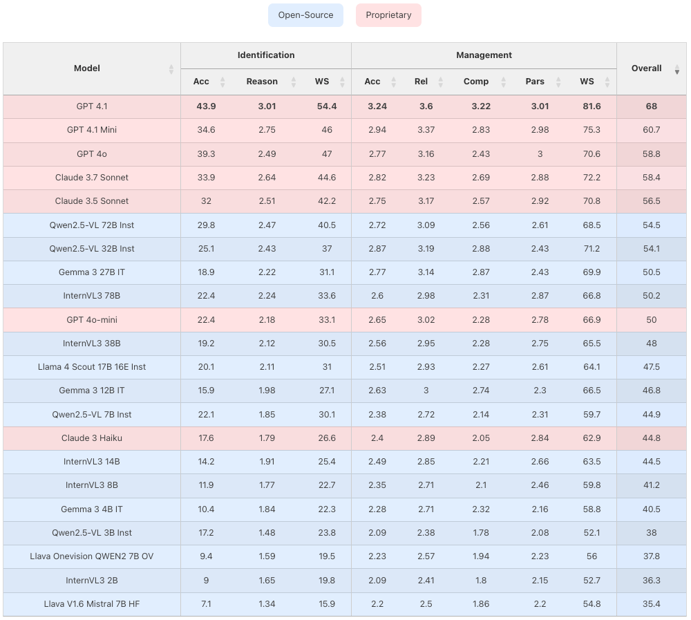

# MIRAGE Benchmark

<div align="center">
  
</div>

<div align="center">
 <h3>Multimodal Information-Seeking and Reasoning in Agricultural Expert-Guided Conversations</h3>
</div>

## 🏆 Leaderboard - Single Turn 

<div align="center">
  
</div>

## 📊 Benchmark Repository

For the complete benchmark, evaluation code, and detailed documentation, visit our main repository:

**[MIRAGE-Benchmark/MIRAGE](https://github.com/MIRAGE-Benchmark/MIRAGE)**

## 📄 Paper

**MIRAGE: A Benchmark for Multimodal Information-Seeking and Reasoning in Agricultural Expert-Guided Conversations**

Available on arXiv: [2506.20100](https://arxiv.org/abs/2506.20100)

## 📚 Citation

```bibtex
@article{dongre2025mirage,
  title={MIRAGE: A Benchmark for Multimodal Information-Seeking and Reasoning in Agricultural Expert-Guided Conversations},
  author={Dongre, Vardhan and Gui, Chi and Garg, Shubham and Nayyeri, Hooshang and Tur, Gokhan and Hakkani-T{\"u}r, Dilek and Adve, Vikram S},
  journal={arXiv preprint arXiv:2506.20100},
  year={2025}
}
```
